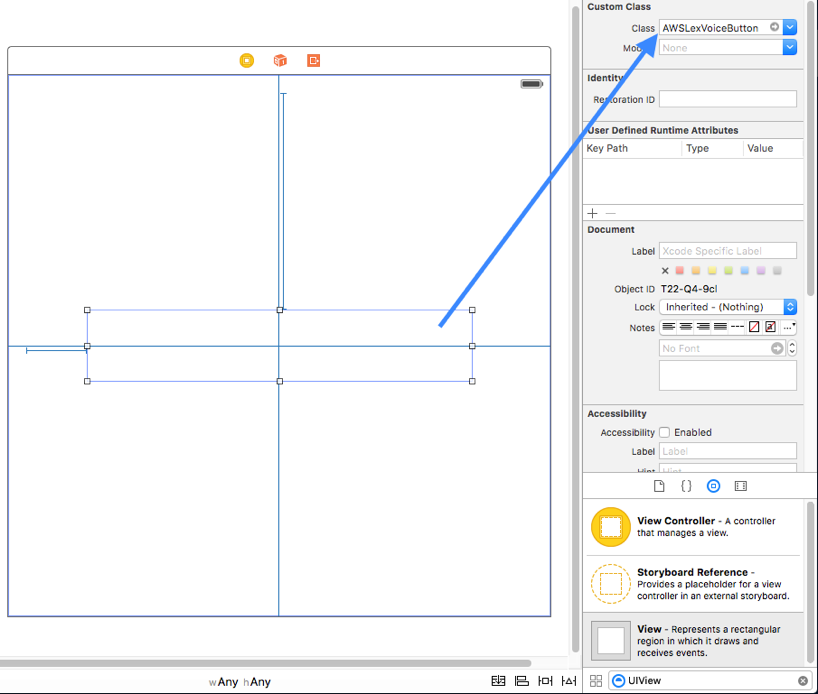

# Interactions

## Overview

Amazon Lex is an AWS service for building voice and text conversational interfaces into applications. With , the same natural language understanding engine that powers Amazon Alexa is now available to any
developer, enabling you to build sophisticated, natural language chatbots into your new and existing
applications.

The The AWS Mobile SDK for iOS provides an optimized client for interacting with Amazon Lex runtime APIs,
which support both voice and text input and can return either voice or text. Included are features
like APIs to support detecting when a user finishes speaking and encoding incoming audio to the format
the Amazon Lex service prefers.

Amazon Lex has built-in integration with AWS Lambda to allow insertion of custom business logic
into your Amazon Lex processing flow, including all of the extension to other services that Lambda makes possible.

For information on Amazon Lex concepts and service configuration, see
[How it Works](http://docs.aws.amazon.com/lex/latest/dg/how-it-works.html) in the Amazon Lex Developer Guide.

To get started using the Amazon Lex mobile client for iOS, you'll need to integrate the SDK for iOS
into your app, set the appropriate permissions, and import the necessary libraries.


## Setting Up

### Include the SDK in Your Project

Follow the instructions on the [Set Up the SDK for iOS](http://docs.aws.amazon.com/mobile/sdkforios/developerguide/setup.html) page to include the frameworks for this service.

### Set IAM Permissions for Amazon Lex

To use Amazon Lex in an application, create a role and attach policies as described in Step 1 of
[Getting Started](http://docs.aws.amazon.com/lex/latest/dg/gs-bp-prep.html) in the Amazon Lex Developer Guide.

To learn more about IAM policies, see [Using IAM](http://docs.aws.amazon.com/IAM/latest/UserGuide/IAM_Introduction.html).

### Configure a Bot

Use the [Amazon Lex console](https://console.aws.amazon.com/lex/) console to configure a bot that interacts with your mobile app features. To learn more, see [Amazon Lex Developer Guide](https://docs.aws.amazon.com/lex/latest/dg/what-is.html). For a quickstart, see [Getting Started](https://alpha-docs-aws.amazon.com/lex/latest/dg/getting-started.html).

Amazon Lex also supports model building APIs, which allow creation of bots, intents, and slots at runtime. This SDK does not currently offer additional support for interacting with Amazon Lex model building APIs.

## Implement Text and Voice Interaction with Amazon Lex

### Add Permissions and Get Credentials

Take the following steps to allow your app to access device resources and AWS services.

#### Add permission to use the microphone

To add permission to use the microphone to enable users to speak to Amazon Lex through your app, open your project's `Info.plist` file using `Right-click > Open As > Source Code`, and then add the following entry.

```xml
<plist version="1.0">
    . . .
    <dict>
        <key>NSMicrophoneUsageDescription</key>
        <string>For interaction with Amazon Lex</string>
    </dict>
     . . .
</plist>
```

### Integrating the Interaction Client

Take the following steps to integrate the Amazon Lex interaction client with your app.

#### Initialize the `InteractionKit` for voice and text

Add the following code using the name and alias of your Lex bot to initialize an  instance of `InteractionKit`.


```swift
let chatConfig = AWSLexInteractionKitConfig.defaultInteractionKitConfig(withBotName: BotName, botAlias: BotAlias)

// interaction kit for the voice button
AWSLexInteractionKit.register(with: configuration!, interactionKitConfiguration: chatConfig, forKey: "AWSLexVoiceButton")

chatConfig.autoPlayback = false

// interaction kit configuration for the client
AWSLexInteractionKit.register(with: configuration!, interactionKitConfiguration: chatConfig, forKey: "chatConfig")
```

#### Implement `InteractionKit` delegate methods

Declare and implement the following methods in the class where you intend to use your `InteractionKit`:

- `interactionKit` is called to begin a conversation. When passed `interactionKit`, `switchModeInput`, and `completionSource`, the function should set the mode of interaction (audio or text input and output)  and pass the `SwitchModeResponse` to the `completionSource`. On error, the `interactionKit:onError` method is called.

```swift
      public func interactionKit(_ interactionKit: AWSLexInteractionKit, switchModeInput:
        AWSLexSwitchModeInput, completionSource: AWSTaskCompletionSource<AWSLexSwitchModeResponse>?)

      public func interactionKit(_ interactionKit: AWSLexInteractionKit, onError error: Error)
```

- Amazon Lex`interactionKitContinue` is called to continue an ongoing conversation with its transaction state and metadata maintained.

```swift
func interactionKitContinue(withText interactionKit: AWSLexInteractionKit, completionSource: AWSTaskCompletionSource<NSString>){
    textModeSwitchingCompletion = completionSource
}
```

  Alternatively, you can explicitly set `SwitchModeResponse` to a selected mode.

  ```swift
  let switchModeResponse = AWSLexSwitchModeResponse()
  switchModeResponse.interactionMode = AWSLexInteractionMode.text
  switchModeResponse.sessionAttributes = switchModeInput.sessionAttributes
  completionSource?.setResult(switchModeResponse)
  ```

#### Begin or Continue a Conversation

When you call `InteractionKit` to provide input for a conversation, check if the conversation is already in progress by examining the state of `AWSTaskCompletionSource`. The following example illustrates the case where `textModeSwitchingCompletion` is an `AWSTaskCompletionSource` instance and the desired result is that a new conversation will be in the `texttInTextOut` mode.

```swift
                if let textModeSwitchingCompletion = textModeSwitchingCompletion {
                        textModeSwitchingCompletion.setResult(text)
                        self.textModeSwitchingCompletion = nil
                    }
                    else {
                        self.interactionKit?.textInTextOut(text)
                    }
```

### Integrating Voice Conversation

Perform the following tasks to implement voice interaction with Amazon Lex in your iOS app.

#### Add a voice button and bind it to the Lex SDK UI component

Add a voice UIView into your storyboard scene or xib file, add a voice button (the UI element that enables users to speak to Amazon Lex). Map the voice button to the SDK button component by setting the `class` for the voice UIView to `AWSLexVoiceButton` as illustrated in the following image.


